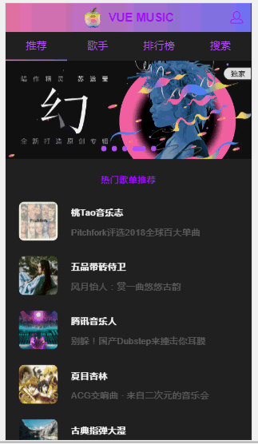

# vue-music

> Vue 搭建音乐 Webapp.

## 技术栈

- `Vue :` 用于构建用户界面的 MVVM 框架
- `Vue-Router :` 单页面应用路由管理器
- `Vuex :` 集中式存储管理应用的所有状态
- `Scss :` CSS 预编译处理器 | 使编写样式代码结构化
- `Axios :` 基于 Promise 的 HTTP 库 | 用来请求数据
- `ES6 :` ECMAScript 新一代语法

## 项目结构

<pre>

|-- build                            // 项目构建（webpack）相关代码
|-- config                           // 项目开发环境配置
|-- src                              // 源码目录
|   |-- api                             // 与后台数据交互的接口文件
|   |-- assets                          // font | img | js | scss
|   |-- components                      // 项目公共组件
|   |-- page                            // 项目页面组件
|   |-- router                          // vue 的路由管理
|   |-- store                           // vue 的状态管理
|   |-- App.vue                         // 页面入口文件
|   |-- main.js                         // 程序入口文件，加载各种公共组件
|-- static                           // 静态文件，比如一些图片，JSON 数据等
|-- .babelrc                         // ES6 语法编译配置
|-- .editorconfig                    // 定义代码格式
|-- .gitignore                       // git 上传需要忽略的文件格式
|-- .postcsssrc                      // postcss 配置文件
|-- README.md                        // 项目说明
|-- index.html                       // 入口页面
|-- package.json                     // 项目基本信息,包依赖信息等

</pre>

## 组件介绍

<pre>

|-- src                              // 源码目录
|   |-- components                      // 项目公共组件
|       |-- confirm                        // 确认对话框组件
|       |-- header                         // 页面头部组件
|       |-- loading                        // 加载态组件
|       |-- music_list                     // 歌曲列表页面组件
|       |-- nav_table                      // 顶部导航栏组件
|       |-- scroll                         // 移动端滚动组件
|       |-- search_box                     // 搜索框组件
|       |-- search_list                    // 搜索列表组件
|       |-- song_list                      // 歌曲列表组件
|       |-- suggest                        // 搜索结果列表组件
|           |-- no_result                     // 无结果组件
|       |-- switch_table                   // 开关切换组件
|   |-- page                         // 项目页面组件
|       |-- play_list                    // 播放列表组件
|           |-- add_song                    // 添加歌曲组件
|               |-- top_tip                    // 顶部消息提示组件
|       |-- player                       // 播放器内核组件
|           |-- progress_bar                // 进度条组件
|       |-- rank                         // 排行榜页面组件
|       |-- rank_detail                  // 排行榜详情组件
|       |-- recommend                    // 推荐页面组件
|           |-- slider                      // 轮播图组件
|       |-- recommend_songList           // 推荐页面歌单列表组件
|       |-- search                       // 搜索页面组件
|       |-- singer                       // 歌手页面组件
|           |-- listview                    // 通讯录列表组件
|       |-- singer_detail                // 歌手详情页组件
|       |-- user                         // 用户中心组件

</pre>

## 项目展示



## 项目运行

``` bash
# install dependencies
npm install

# serve with hot reload at localhost:8080
npm run dev

# build for production with minification
npm run build

# build for production and view the bundle analyzer report
npm run build --report
```


